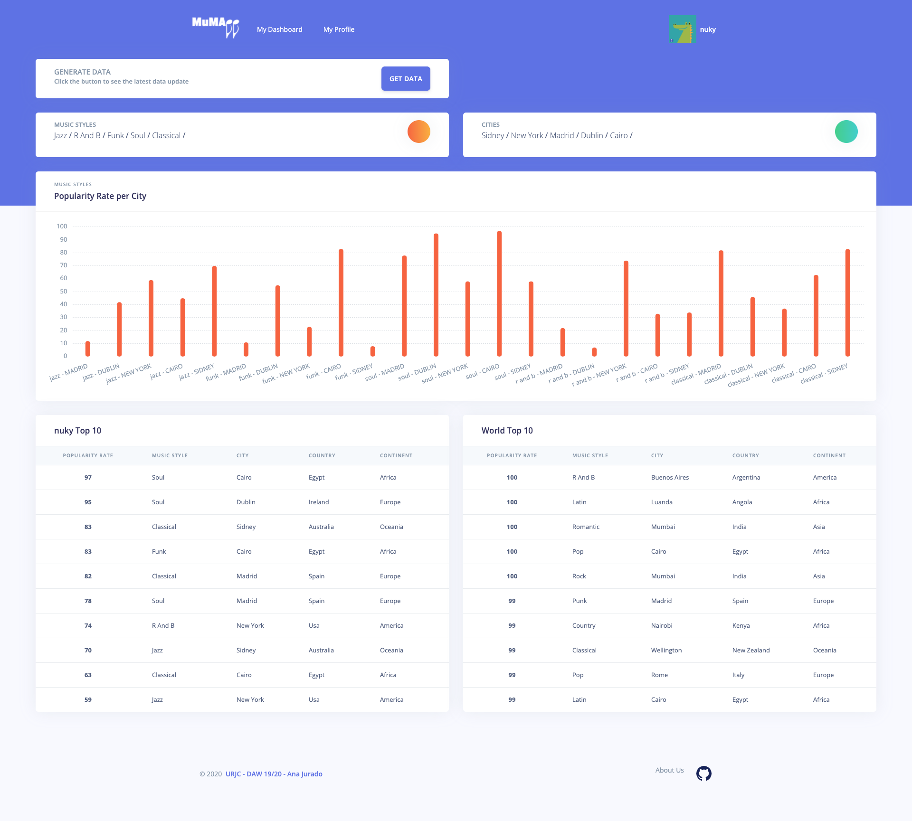
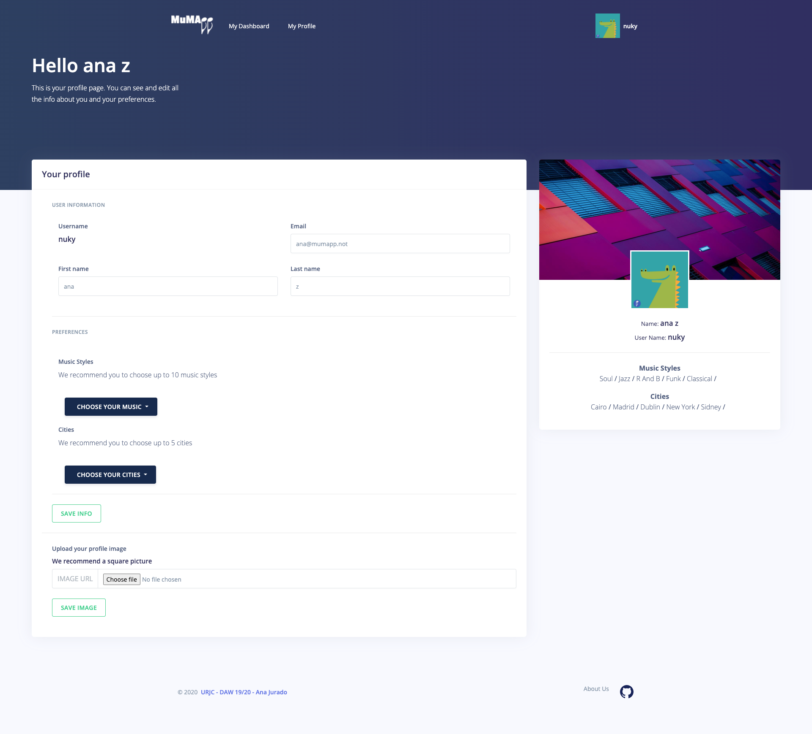
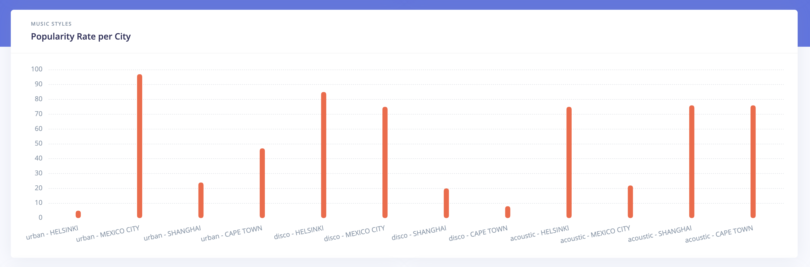
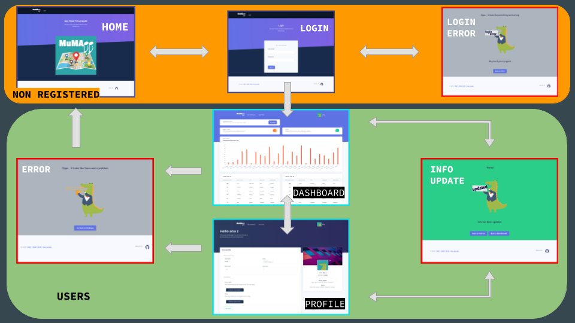
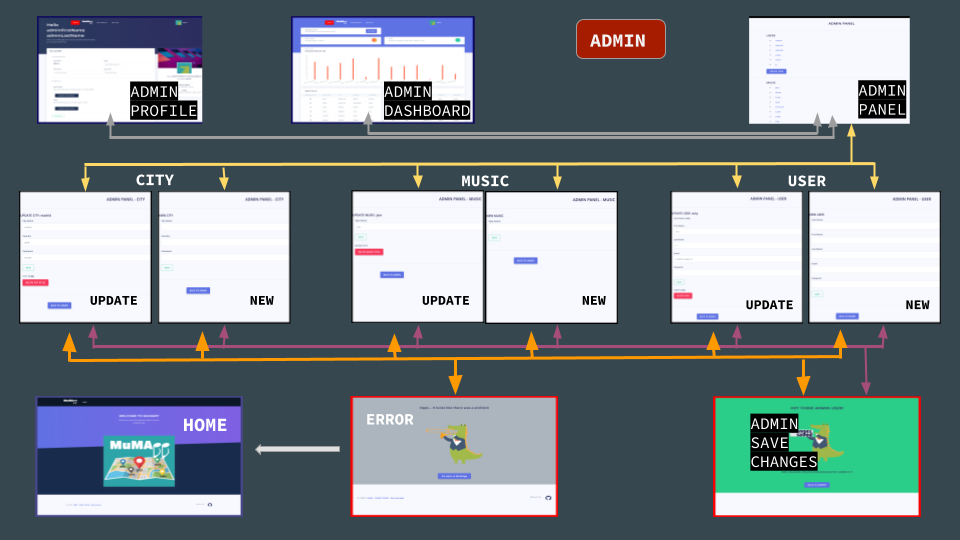
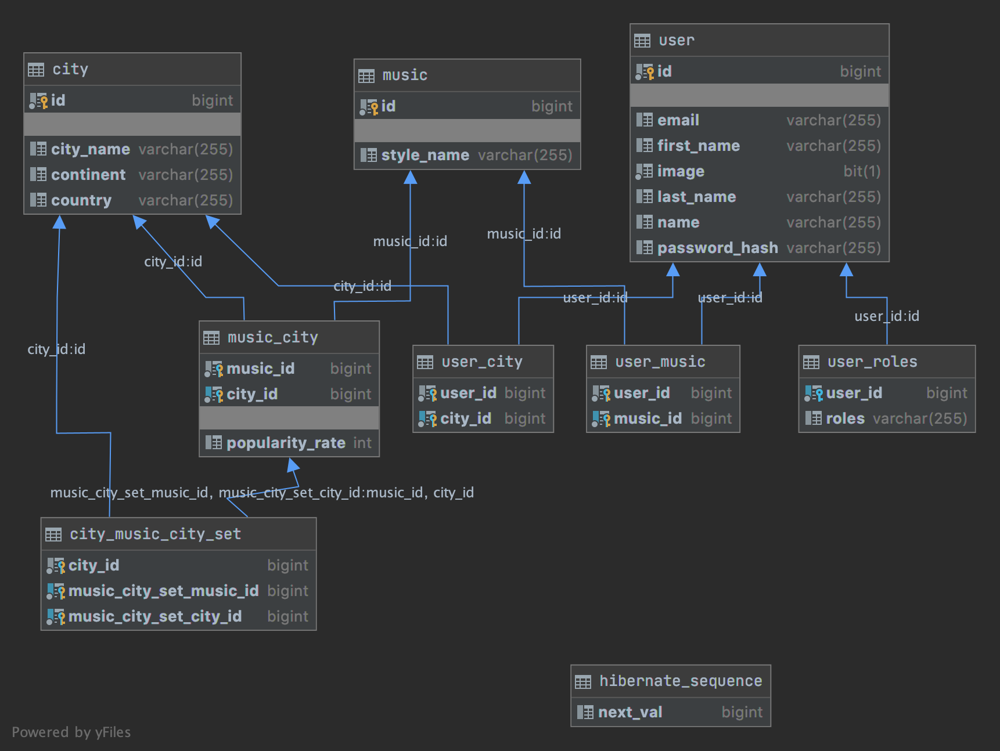
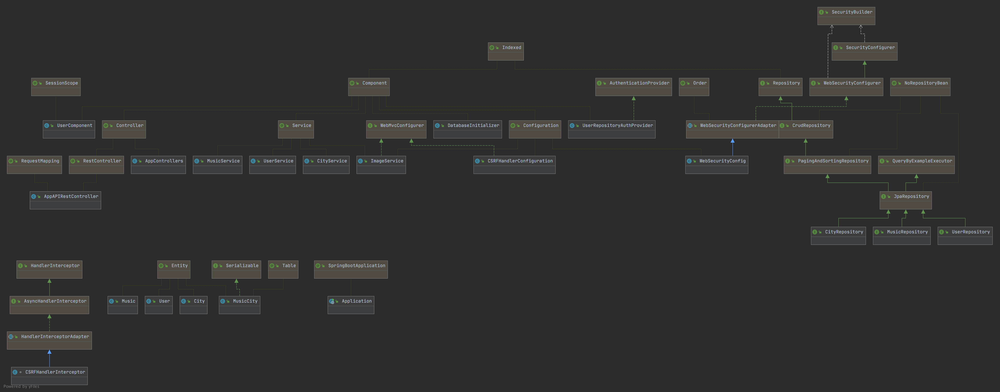
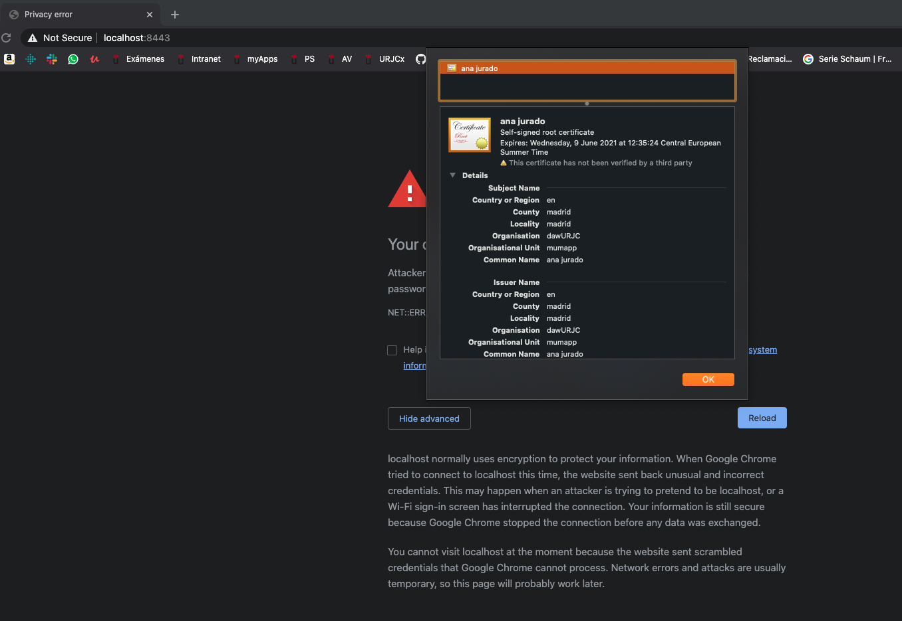
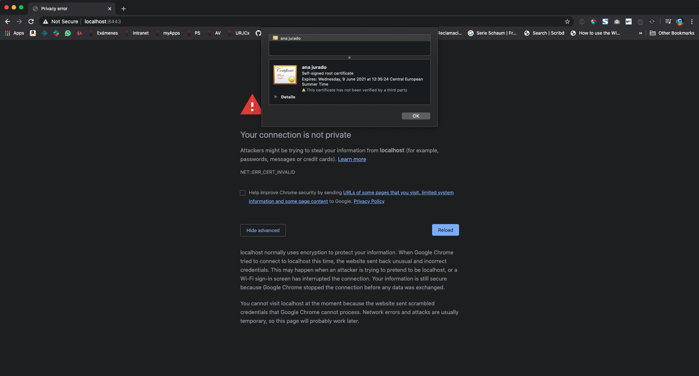

# MuMApp - Music Map Web App

**App name:** MuMApp\
**Developers team members:**
- Ana M Jurado Crespo 
    - email: anajuradoc@alumnos.urjc.es
    - github: https://github.com/anaJurado
    
---

##What is MuMApp about?

This app allows you to choose your favorite music styles and preferred cities all around the globe. 
With that information, MuMApp provides you with the latest popularity rates of those styles in your chosen cities. 
You can also check the info of the most popular music styles all around the globe.

### Dashboard
In the dashboard page you can find the information about the music styles and cities the user has chosen as well as the information about the top ten popular music styles in the cities
There is also a button **GET DATA** that the user can use whenever he/she wants to refresh the data.



### Profile
In the profile page the user can see the personal data and update it as he/she wants. There is also the possibility to upload a profile image.


---

## App Main Aspects 
### Entities
This app has 3 main entities:
- User
- Music
- City

A user can choose n music styles and m cities.
A music style can be chosen by n users and every style is related to every city.
A city can be chosen by n users and every city is related to every music style.
Every musical style is related to every cities sharing one attribute, the popularity rate of that style in that city.

### Frontend theme
I've used a free theme template for the frontend side by Creative Tim:
**Theme:** https://www.creative-tim.com/product/argon-dashboard
**Live preview:** https://demos.creative-tim.com/argon-dashboard/index.html?_ga=2.159075512.384130023.1599379603-2127710504.1590785900
**Docs:** https://demos.creative-tim.com/argon-dashboard/docs/getting-started/overview.html?_ga=2.159075512.384130023.1599379603-2127710504.1590785900

### User permissions
The application contemplates three types of users:
- **Not registed:** Only have access to the main page and login page
- **Registed user:** It has access to the dashboard and profile pages
- **Admin:** It has also access to the admin panel

### Images
Every registed user and admin user have the option to upload a profile image to be used in the profile page and top navbar


### Graphics
In the dashboard view we can find a bar graphic showing:
- **X axis:** music and city tuples chosen by the user
- **Y axis:** Popularity rate between 0 and 100



There is a couple of tables that show data as well in the dashboard page.


### Advance Query
Due to the nature of the data schema that it's been created from the code by Spring I had to implement some advance queries.
Any query related to popularity rates had to be written as a because it wasn't possible to use the prebuilt Spring Data methods.
For example, to be able to find the popularity rates between the music styles and cities choosen by a user, this quey had to be implemented as follows:

    @Query ( value = "SELECT m.style_name, c.city_name, music_city.popularity_rate 
                      FROM music_city 
                            JOIN music m on music_city.music_id = m.id 
                            JOIN city c on music_city.city_id = c.id 
                      WHERE music_id in 
                                ( SELECT music_id as userMusicId 
                                  FROM user JOIN user_music um on user.id = um.user_id 
                                  WHERE user.id = ?1 ) 
                            and city_id in 
                                ( SELECT city_id as userCityId 
                                FROM user JOIN user_city uc on user.id = uc.user_id 
                                WHERE user.id = ?1 )
                      ",
             nativeQuery = true)
    Page<Object> findPopularityRateByUserIdPagination(long id, Pageable page);

As the popularity rate is randomly generated and can be "refresh" by the user, we've created three queries that populates the *music_city* table with all the music styles and cities using cross join first and then generates a random number between 0 and 100 to populate the field *popularity_rate*

    @Modifying
    @Query( value="INSERT INTO music_city (music_id, city_id) SELECT music.id music_id, city.id as city_id 
                    FROM music CROSS JOIN city",
            nativeQuery=true)
    void crossJoinMusicCity();

    @Modifying
    @Query( value="UPDATE music_city SET popularity_rate = 100 * RAND() WHERE 1",
            nativeQuery=true)
    void randomData();

More advance queries can be found in MusicRepository.java

### Web Navigation
Here is a scheme of the navigation that is possible to do in the app differentiating by the different users roles




You can also see it here:  [Web navigation pdf document](documents/mumapp-web_navigation.pdf)

### Data Base Diagram



You can also download the uml file here:  [Data Base Diagram UML](documents/SCHEMA:mumappdb.uml)

### Class Diagram



You can also download the uml file here:  [Class Diagram UML](documents/mumapp_class_diagram.uml)

### Development Instructions

To configure the development environment and to develop a Spring Boot application, we will need a program that provides us with the structure of the packages to make the application as well as to manage the dependencies of Maven. To start we will download the program, I have used INTELLIJ, which can be downloaded from the following link https://www.jetbrains.com/es-es/idea/, once installed to create a project we will have to go to File -> New -> Sring Starter Project and we would have our project ready to start developing and working.
The code can be download here: https://github.com/anaJurado/mumapp_web_app.git

### Start the application
**Windows:** We need to have XAMPP installed to run the MYSQL process or MysqlCommunityServer. We need to have Workbench installed to manage the tables.

The first thing we will do will be to give you start in the xampp part to start the MYSQL process, then we start the workbench and give you run to connect the database. Finally, we will give the run spring boot application in our sts and we could already access our application.

**MacOs:** We need to have XAMPP installed to run the MYSQL process or MysqlCommunityServer. We need to have Workbench installed to manage the tables.

First of all, we need install MysqlCommunityServer and MysqlWorkbench, an IDE to manage the database. We also may manage the database through the console terminal. After that, we create a database with the name "daw" into MysqlWorkbench. Finally, we include the following lines into the application.properties file to indicate how to connect to the datase:

`spring.datasource.url=jdbc:mysql://localhost/daw 
spring.datasource.username=root 
spring.datasource.password= 
spring.datasource.driverClassName=com.mysql.jdbc.Driver 
spring.jpa.hibernate.ddl-auto=create-drop
`
Note: MacOs maybe will not add to the $PATH the mysql Server process. We need to run server into settings page and include it to the path into ~/.bash_profile

---
## Bugs

### Update
I need to implement a DTO class to manage the entity USER. I don't know how to do it. Since that implementation is not done, some problems are derived from that one:
- When a user updates its own info in the profile page, music and cities previously selected get deleted and the user can't update that info either.
- There is no way to make the checkboxes in the list checked because the info about user_music and user_city is not readable in the frontend
- When an admin user updates the info of a user in the admin panel, it fails because of the same reason

In **AppControllers.java**:

```    
   @PostMapping("/saveUser")
    public String saveUser(Model model, User user, HttpServletRequest request) {
    
        // IF NEW USER
        if (user.getId() == Long.valueOf(0)) {
            String firstName = user.getFirstName();
            String lastName = user.getLastName();
            String name = user.getName();
            String email = user.getEmail();
            String pass = user.getPasswordHash();
            userRepository.save(new User(firstName, lastName, name, email, pass, "ROLE_USER"));
        }

        return "info_updated";
    }
```

In **AppAPIRestController.java**:

```   
   @PutMapping("/user/{id}")
   public User updateUserById(@PathVariable long id, @RequestBody User updatedUser) {
       userRepository.findById(id).getId(); //Returns with 404 if not found in database
       updatedUser.setId(id);
       userRepository.save(updatedUser);
       return updatedUser;
   }
```
    
### logout
Logout functionality doesn't work properly. Once you clicked in logout you can comeback to yout user profile typing the url so it seem that the session doesn't finished properly.

---

## FASE 3
### API
The API class was created in the previous fase but in this fase I have updated it and make sure that AppController and AppAPIRestController were using the Service layer to avoid duplicated code.
In this link you can find the API documentation.

[API Postman Collection](documents/api.postman_collection.json)

**Note:** In order to be able to test the API in POSTMAN I had to disable the CSFR protection and the HTTPS.
I had problem creating the Security certificate and this app is using a _local created_ certificate so that gives some problems.

 
 

